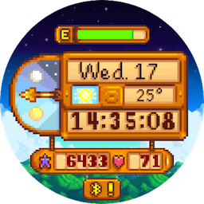

A collection of imported, custom, and modified watchfaces with **466x466 resolution** for modern Amazfit smartwatches (Zepp OS).

## Compatibility
These watchfaces are designed and optimized for 466x466 screens. They should be compatible with:

- Amazfit GTR 4
- Amazfit Active 2 (Round)
- Amazfit Active 3
- Amazfit T-Rex 3 Pro (44mm)
- Amazfit Cheetah 2 Pro

## Available Watchfaces

### 1. Stardew Valley

* **Author**: `max.marauder`
* **Version**: `1.0.6+r1`
* **App ID**: `1089671`
* **Source**: Official Zepp store package
* **Repository Path**: [`stardew-valley/1089671`](stardew-valley/1089671)

**Summary:** A tribute to Stardew Valley with digital time, date and weekday, current weather and temperature, sunrise/sunset progress, steps and progress indicator, heart rate, battery level, Bluetooth status, and Always-on Display support.

**What's Modified:** Reworked the sunrise/sunset pointer to match the adapted background's 06:00-02:00 sky cycle, avoiding the stock behavior that entered the night state before sunset and snapped back to 180 degrees after sunset. Tapping the date now opens the system calendar.

## Credits & Disclaimer

Some watchfaces in this repository are ported, translated, imported, or modified based on the works of other designers.

- All original design copyrights belong to their respective creators.
- Modifications (such as resolution scaling to 466x466, localizations, or code optimizations) are made under non-commercial open-source guidelines.
- If you are an original author and wish to have your design removed, please open an Issue.
