A collection of imported, custom, and modified watchfaces with **466x466 resolution** for modern Amazfit smartwatches (Zepp OS).

## Compatibility
These watchfaces are designed and optimized for 466x466 screens. They should be compatible with:

- Amazfit GTR 4
- Amazfit Active 2 (Round)
- Amazfit Active 3
- Amazfit T-Rex 3 Pro (44mm)
- Amazfit Cheetah 2 Pro

## Available Watchfaces

### 1. Stardew Valley

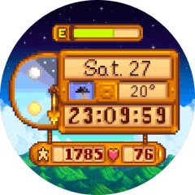 　  

* **Author**: `max.marauder`
* **Version**: `1.0.6-r1`
* **App ID**: `1089671`
* **Source**: Official Zepp store package
* **Repository Path**: [`stardew-valley/1089671`](stardew-valley/1089671)

**What's Modified by Version:**

#### `1.0.6-r1`

- Reworked the `sunrise and sunset` pointer to match the adapted background's `06:00`-`02:00` sky cycle, replacing the stock behavior that entered the night state before sunset and snapped back after sunset.
- The `sunrise and sunset` pointer now follows a `210`->`300` daytime arc, moves from `300`->`360` after sunset until `02:00`, then re-enters from `180`->`210` before sunrise.
- Tapping the `date` now opens the system calendar.

### 2. Planetary Universe

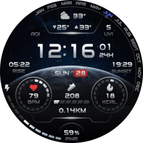 　 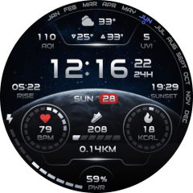 

* **Author**: `zeppewf001`
* **Version**: `1.0.1-r1`
* **App ID**: `1091567`
* **Source**: Official Zepp store package
* **Repository Path**: [`planetary-universe/1091567`](planetary-universe/1091567)

**What's Modified by Version:**

#### `1.0.1-r1`

- Added an `AQI` readout to the weather header so the number now matches the `AQI` label already present in the background.
- Added tap targets for the `weather`, `sunrise and sunset`, `heart rate`, `steps`, `calories`, `battery`, and `date` sections.
- Tapping the `date` now opens the system calendar.

### 3. Nonius

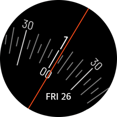

* **Author**: `n.demitsuri`
* **Version**: `1.2.0`
* **App ID**: `1099505`
* **Source**: Official Zepp store package
* **Repository Path**: [`nonius/1099505`](nonius/1099505)

**What's Modified by Version:**

#### `1.2.0`

- Imported the official Zepp store package into the repository as an unmodified upstream baseline.

### 4. Superstructure

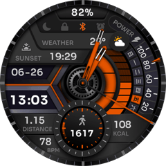

* **Author**: `zeppewf003`
* **Version**: `1.0.2`
* **App ID**: `1070401`
* **Source**: Official Zepp store package
* **Repository Path**: [`superstructure/1070401`](superstructure/1070401)

**What's Modified by Version:**

#### `1.0.2`

- Imported the official Zepp store package into the repository as an unmodified upstream baseline.

### 5. MS-DOS

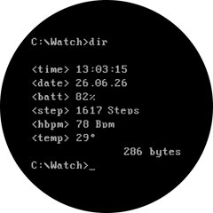

* **Author**: `CyberPashka`
* **Version**: `1.0.4`
* **App ID**: `1094543`
* **Source**: Official Zepp store package
* **Repository Path**: [`ms-dos/1094543`](ms-dos/1094543)

**What's Modified by Version:**

#### `1.0.4`

- Imported the official Zepp store package into the repository as an unmodified upstream baseline.

### 6. Concentric Data

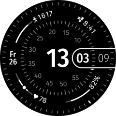

* **Author**: `n.demitsuri`
* **Version**: `3.0.0`
* **App ID**: `1097457`
* **Source**: Official Zepp store package
* **Repository Path**: [`concentric-data/1097457`](concentric-data/1097457)

**What's Modified by Version:**

#### `3.0.0`

- Imported the official Zepp store package into the repository as an unmodified upstream baseline.

### 7. Aperture Laboratories

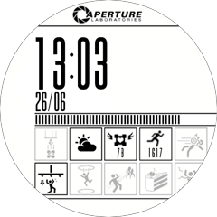

* **Author**: `d_melli`
* **Version**: `1.0.1`
* **App ID**: `1056596`
* **Source**: Official Zepp store package
* **Repository Path**: [`aperture-laboratories/1056596`](aperture-laboratories/1056596)

**Summary:** A Portal-inspired test chamber watchface with digital time and date, an animated battery indicator, weather, step count, heart rate, and Always-on Display support.

**What's Modified by Version:**

#### `1.0.1`

- Imported the official Zepp store package into the repository as an unmodified upstream baseline.

### 8. Grid Master

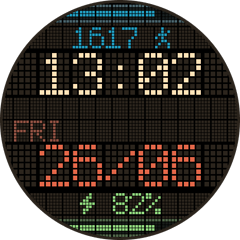

* **Author**: `SG KOVU`
* **Version**: `1.0.3`
* **App ID**: `1056950`
* **Source**: Official Zepp store package
* **Repository Path**: [`grid-master/1056950`](grid-master/1056950)

**What's Modified by Version:**

#### `1.0.3`

- Imported the official Zepp store package into the repository as an unmodified upstream baseline.

### 9. 法阵

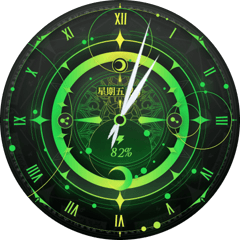

* **Author**: `Zepp Health`
* **Version**: `1.0.7`
* **App ID**: `1005683`
* **Source**: Official Zepp store package
* **Repository Path**: [`circle/1005683`](circle/1005683)

**What's Modified by Version:**

#### `1.0.7`

- Imported the official Zepp store package into the repository as an unmodified upstream baseline.

### 10. 几何

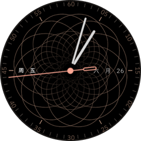

* **Author**: `Zepp Health`
* **Version**: `1.0.6`
* **App ID**: `1005546`
* **Source**: Official Zepp store package
* **Repository Path**: [`geometry/1005546`](geometry/1005546)

**What's Modified by Version:**

#### `1.0.6`

- Imported the official Zepp store package into the repository as an unmodified upstream baseline.

### 11. Daytoday Advanced

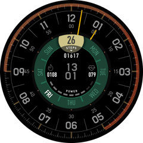

* **Author**: `mandrian`
* **Version**: `1.0.3`
* **App ID**: `1024980`
* **Source**: Official Zepp store package
* **Repository Path**: [`daytoday-advanced/1024980`](daytoday-advanced/1024980)

**What's Modified by Version:**

#### `1.0.3`

- Imported the official Zepp store package into the repository as an unmodified upstream baseline.

### 12. Pipboy Active 2 Eng Anim

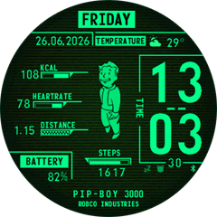

* **Author**: `Jacobitu`
* **Version**: `1.0.1`
* **App ID**: `7827476`
* **Source**: [`active/view/951`](https://amazfitwatchfaces.com/active/view/951)
* **Repository Path**: [`pipboy/7827476`](pipboy/7827476)

**What's Modified by Version:**

#### `1.0.1`

- Imported the community package into the repository as an unmodified upstream baseline.

### 13. CASIO F-91W

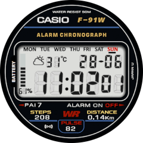 　 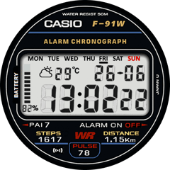 

* **Authors**: `jcmgennesis` (Original) -> `Kulon-24` -> `eliasf` -> `Baranaked` -> `Postmortem`
* **Version**: `1.0.1-r1`
* **App ID**: `8242388`
* **Source**: [`active/view/2268`](https://amazfitwatchfaces.com/active/view/2268)
* **Repository Path**: [`casio-f-91w/8242388`](casio-f-91w/8242388)

**What's Modified by Version:**

#### `1.0.1-r1`

- Restored the iconic blue outer ring of the Casio F-91W to the watch face border.
- Removed the non-functional `DISTURB` icon and the redundant symmetrical `DISCONNECT` icon from the bottom section for a cleaner, more authentic look.
- Refined the background by unifying the previous overlapping dark blue and black patches into a solid black backdrop, eliminating uneven color fragments under high brightness.

#### `1.0.1`

- Imported the community package into the repository as an unmodified upstream baseline.

### 14. Vero

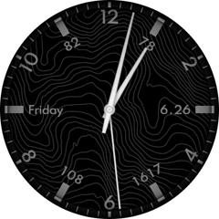

* **Author**: `T_5`
* **Version**: `1.0.3`
* **App ID**: `1023706`
* **Source**: [`gtr/view/33253`](https://amazfitwatchfaces.com/gtr/view/33253)
* **Repository Path**: [`vero/1023706`](vero/1023706)

**What's Modified by Version:**

#### `1.0.3`

- Imported the community package into the repository as an unmodified upstream baseline.

### 15. HT T3 063 Neon Gen3

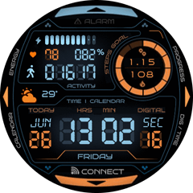

* **Author**: `alien777`
* **Version**: `1.0.1`
* **App ID**: `959038`
* **Source**: [`active/view/1519`](https://amazfitwatchfaces.com/active/view/1519)
* **Repository Path**: [`ht-neon-gen3/959038`](ht-neon-gen3/959038)

**What's Modified by Version:**

#### `1.0.1`

- Imported the community package into the repository as an unmodified upstream baseline.

### 16. White Art

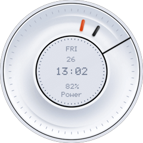

* **Author**: `Avoska1988`
* **Version**: `1.0.1`
* **App ID**: `4475686`
* **Source**: [`gtr/view/44314`](https://amazfitwatchfaces.com/gtr/view/44314)
* **Repository Path**: [`white-art/4475686`](white-art/4475686)

**What's Modified by Version:**

#### `1.0.1`

- Imported the community package into the repository as an unmodified upstream baseline.

## Local Tooling

Use the repository CLI from the root directory:

```bash
./watchface list
./watchface preview
./watchface preview --watchface planetary-universe
./watchface bump --watchface planetary-universe
./watchface bump --watchface planetary-universe --upstream-name 1.0.2 --upstream-code 3
./watchface release
./watchface release --all
```

### `preview`

- Prompts you to choose a watchface by name.
- Runs `zeus preview` inside the selected package directory.

### `release`

- Prompts you to choose one watchface, or all watchfaces at once.
- Validates the local revision suffix in `app.json` using the repository's `-rN` scheme.
- Creates a `.zip` artifact in `artifacts/releases/<watchface-slug>/`.
- Writes a sidecar `.release.json` file with the suggested Git tag and release title for GitHub Releases.
- Writes a `.release.md` file generated from `<watchface>/release-notes.json` for direct use as the GitHub Release body.

### `bump`

- Updates the selected watchface's `app.json` to the next release version.
- Without extra flags, converts an untouched upstream baseline to `-r1`, or increments an existing local revision from `-rN` to `-rN+1`.
- With `--upstream-name` and `--upstream-code`, starts a new upstream version at `-r1`.
- Adds a new `TODO` entry to `<watchface>/release-notes.json`.
- Refreshes the README version block for that watchface so the new version appears first.

See [RELEASING.md](/Users/fangqiuming/Developer/Personal/amazfit-watchfaces-r466/RELEASING.md) for the GitHub Release workflow.

## Credits & Disclaimer

Some watchfaces in this repository are ported, translated, imported, or modified based on the works of other designers.

- All original design copyrights belong to their respective creators.
- Modifications (such as resolution scaling to 466x466, localizations, or code optimizations) are made under non-commercial open-source guidelines.
- If you are an original author and wish to have your design removed, please open an Issue.
